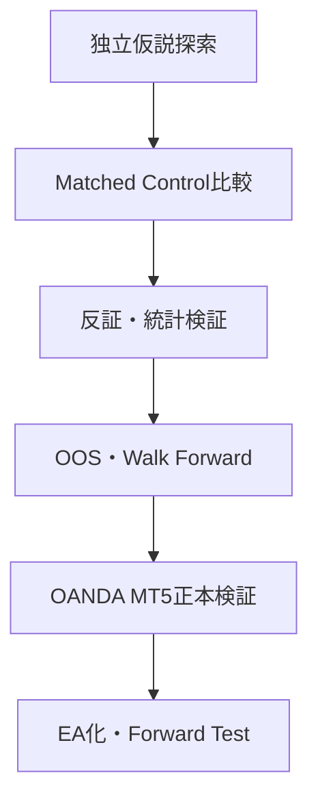

# 自動売買研究プロジェクト｜次セッション引き継ぎ

更新日: 2026-08-28  
対象Repository: `tgkfnfnfv9-stack/Gpt-Verification--software`  
最終運用先: OANDA MT5 本番・スタンダード口座（EA可）

## 1. 最初に確認する結論

STRAT-PA-002は、Dukascopyの実市場バーを使った市場・時間足横断スクリーニングで、再現可能なEdgeを確認できなかった。

**判定: `REJECT_FOR_DEVELOPMENT`**

- 最適化へ進めない
- H4だけを後付け採用しない
- MT5 EA化しない
- Final Holdoutは開封しない
- 失敗結果は削除せず、Rejected Strategyとして保存する

今回のRejectは「この現象が永久に存在しない」という意味ではない。今回の凍結ルール・バー構成・Control・検証期間では、次工程へ進める証拠がなかったという意味である。

## 2. プロジェクト全体の目的

複数市場・複数時間足から共通する価格、出来高、ボラティリティ、Regime構造を発見し、反証を生き残った候補だけを最終的にOANDA MT5の自動売買へ実装する。



利益最大値ではなく、再現性、情報リーク防止、Sample Size、Parameter Plateau、未使用期間、現実的約定を優先する。

## 3. 完了済み工程

| 工程 | 状態 |
|---|---|
| 研究基盤・Agent責任分界 | 完了 |
| FX・商品・複数時間足の横断設計 | 完了 |
| 未検証仮説15件の事前登録 | 完了 |
| Outcome非閲覧の反証レビュー | 完了 |
| PA-002 Signal/MTF/Controlエンジン | 実装・合成試験合格 |
| GitHub Actionsによる実市場データ取得 | 完了 |
| PA-002 M15/H1/H4予備検証 | 完了・Reject |
| OANDA MT5 Canonical検証 | 未実施 |
| Walk Forward・EA化 | 未実施 |

ローカル研究基盤のテストは33/33件合格した。

## 4. 検証対象と期間

### 銘柄

- FX: AUDJPY、AUDUSD、EURGBP、EURJPY、EURUSD、GBPJPY、GBPUSD、USDJPY
- Precious Metals: XAUUSD、XAGUSD
- Energy: 今回は未取得

### 時間足

- M15
- H1
- H4

### 期間

| 区分 | 期間 |
|---|---|
| Discovery | 2019-08-28〜2022-08-28 |
| Development | 2022-08-28〜2024-08-28 |
| OOS | 2024-08-28〜2025-08-28 |
| Final Holdout | 2025-08-28〜2026-08-28、未開封 |

## 5. PA-002の仮説

効率的に一方向へ進んだ後、直近20本の高値・安値を更新し、その同じ足で強く拒否された場合、先行方向と逆方向の3本先Returnに偏りがあるかを調べた。

正式な凍結条件は `spec/pa002.yaml` を参照する。結果を見た後に閾値、銘柄、方向、時間足を変更して同じStrategy IDを使ってはならない。

## 6. 実市場スクリーニング結果

| 時間足 | セル | Matched Signal | 加重平均Edge | 全期間プラスセル | 95% CIがプラス | 全3期間プラス |
|---|---:|---:|---:|---:|---:|---:|
| M15 | 10 | 8,836 | −0.0230 ATR | 2/10 | 0/10 | 0/10 |
| H1 | 10 | 2,119 | −0.0619 ATR | 1/10 | 0/10 | 0/10 |
| H4 | 10 | 490 | +0.0378 ATR | 6/10 | 0/10 | 3/10 |
| 合計 | 30 | 11,445 | −0.0276 ATR | 9/30 | 0/30 | 3/30 |

期間別のSignal件数加重平均Edge:

- Discovery: −0.0397 ATR
- Development: −0.0499 ATR
- OOS: +0.0517 ATR

H4で3期間すべてプラスだったAUDJPY、AUDUSD、EURJPYのOOS Signal数は10、8、1件。小標本であり、時間足を結果閲覧後にH4へ限定することは過学習になる。

## 7. Reject理由

1. M15とH1の加重平均Edgeがマイナス。
2. 全期間Bootstrap 95%信頼区間がゼロより上のセルは0件。
3. H4の好成績セルはOOS Sampleが1〜10件。
4. Development全体がマイナスで、期間間の符号が安定しない。
5. 共通Edge基準のOOS 200 Episode、プラス市場比率70%を満たさない。
6. Energyを含まないため、FX・貴金属・Energy共通Edgeを認定できない。
7. H4だけの採用や閾値変更は、結果閲覧後の後付け最適化になる。

## 8. 実行記録

- M15 GitHub Actions Run: `33167784417`
- H1/H4 GitHub Actions Run: `33175890338`
- Data: Dukascopy JForex BID/ASK
- Downloader: `dukascopy-go v0.2.0`
- Downloader SHA-256: `f78f621d747e7584be2ae6789f6b97e22ae656203cc9ab7a32766f699e455e4b`
- 乱数Seed: `20260828`
- Signal後の次足ASK/BIDでEntryし、3本後の実行可能側Openまでを評価

Raw結果は `results/PA002_M15_summary.json` と `results/PA002_H1H4_summary.json` に保存している。

## 9. 今回の検証の限界

この結果はOANDA MT5の最終ブローカー検証ではなく、Dukascopyバーによる一次スクリーニングである。

- 別々のBID/ASKバーからMID OHLCを近似しており、同期Tick由来MIDではない
- 一時RunnerはControlの同一年・近傍日を強制したが、Split label自体は明示一致させていない
- BootstrapはSignal単位で、同期Global Block Clusterではない
- 多重検定のFamilywise補正を実装していない
- Energy市場が含まれていない

この制約があるため、今回の結果から「仮説が永久にゼロ」とは断定しない。ただし、結果が弱い候補へ追加のOANDAコストを使わないというGate判断には十分である。

## 10. 次セッションで最初に行うこと

### Phase A: 独立探索を再開

既存のLiquidity SweepやPA-002を答えとして与えず、次の3系統を独立に探索する。

1. Price Action
2. Volume / Volatility
3. Market Regime / Cross-Market

各系統から最大5候補、合計最大15候補を提出する。探索はFX・貴金属・EnergyとM15/H1/H4を優先し、バー数固定と実時間固定を分ける。

### Phase B: 候補の提出条件

各候補には最低限、Strategy ID、完全数値ルール、Entry時点で利用可能な情報、Sample Size、Control定義、将来Return、MFE、MAE、年度別、銘柄別、時間足別、弱点を含める。

### Phase C: 反証

反証を通過した候補だけをDevelopment Backtestへ進める。PA-002の結果を見て作った派生案は、新しいStrategy IDと新しい未使用期間が必要。

### Phase D: OANDA MT5正本検証

最終候補だけ、OANDA MT5本番・スタンダード口座のTick/BID/ASK、Spread、Slippage、Commission、Swap、実際のSymbol仕様で再検証する。

## 11. 次Runnerで必ず直す項目

- SignalとControlのSplit label完全一致
- 同期TickからMIDを構成するか、BID Signal仕様を事前登録
- Global time blockによるCluster Bootstrap
- Episode単位の重複除去
- Holm/FDRなどの多重検定補正
- Energy市場追加
- 同期イベントの市場横断重複Weight制限
- Final HoldoutをGate通過候補につき1回だけ評価

## 12. GitHubに置かないデータ

市場のRaw OHLC/Tickデータは容量が大きく、再配布条件やRepository容量の問題があるため保存していない。APIキー、OANDA Token、MT5ログイン情報も保存しない。

Rawデータは固定バージョンのDownloaderで再取得し、取得期間、銘柄、Side、Timeframe、ファイルSHA-256を実験ログへ記録する。

## 13. 次セッション開始用プロンプト

```text
GitHub Repository `tgkfnfnfv9-stack/Gpt-Verification--software` の
`research/phase7-pa002-20260828/NEXT_SESSION_HANDOFF.md` を読んで研究を継続してください。

重要事項:
- STRAT-PA-002はREJECT_FOR_DEVELOPMENT。最適化・H4限定・MT5化は禁止。
- Final Holdout 2025-08-28〜2026-08-28は未開封のまま維持。
- 次はPrice Action、Volume/Volatility、Regimeの3系統で独立探索する。
- FX・貴金属・Energy、M15/H1/H4を優先し、共通する市場構造を探す。
- 最大15候補を提出し、反証を通過した候補だけ厳密Backtestへ進める。
- 最終運用先はOANDA MT5本番・スタンダード口座（EA可）。

まず、GitHub内のSESSION_STATE.json、Decision JSON、Raw Summaryを確認し、
次の探索計画とデータ取得計画を提示してください。
```

